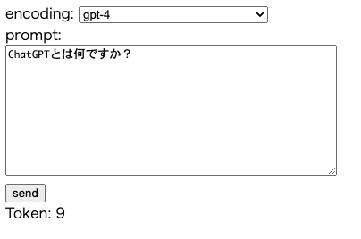

# ChatGPTのトークン数を取得する

tiktokenライブラリを使用して、ChatGPTのトークン数を取得します。



## 使い方

docker composeで起動します。

```sh
docker compose up -d --build
```

Webブラウザで http://localhost:8080/ にアクセスします。

encodingにエンコーディングを指定して、promptに入力する文字列を指定します。

sendボタンを押すと、トークンすが表示されます。

## 解説

エンコーディングの一覧は「tiktoken.model.MODEL_TO_ENCODING.keys()」で取得します。

トークン数の取得は「tiktoken.encoding_for_model」を使用します。

```python
encoding = tiktoken.encoding_for_model(encoding)
tokens = encoding.encode(prompt)
return jsonify({'token_count': len(tokens)})
```
